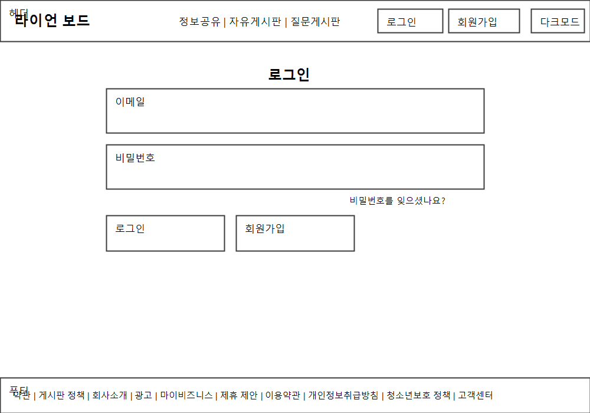
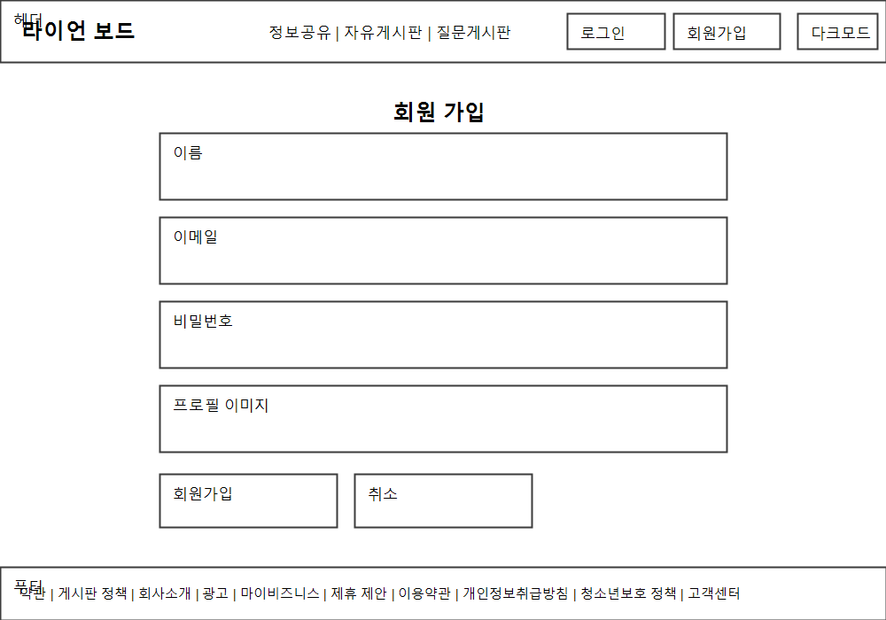
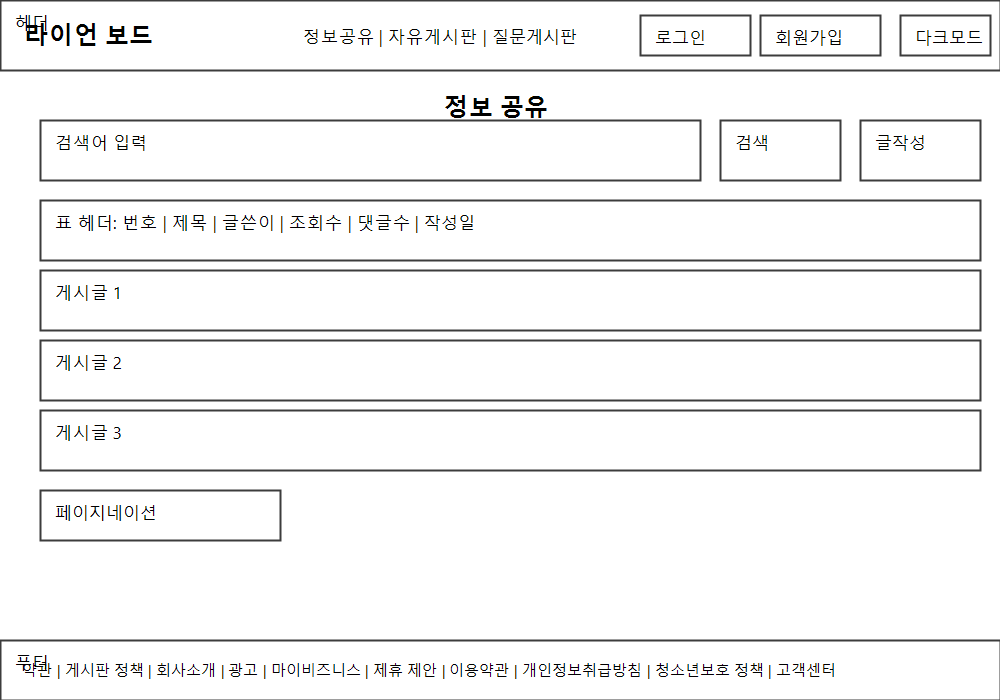
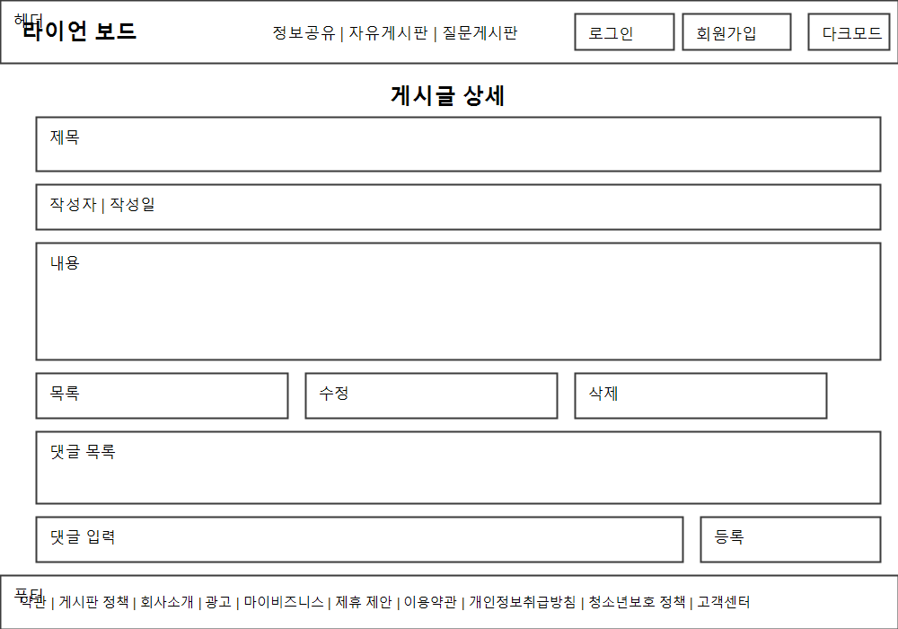

# 화면 정의서

## 1. 화면 목록

| 화면명 | 목적 | 주요 요소 |
| --- | --- | --- |
| 로그인 | 인증 및 진입 | 이메일, 비밀번호 입력, 로그인 버튼 |
| 회원가입 | 계정 생성 | 이메일, 비밀번호, 확인, 가입 버튼 |
| 게시판 목록 | 게시글 탐색 | 게시판 탭, 검색, 글 목록, 글쓰기 버튼 |
| 게시글 상세 | 글/댓글 확인 | 제목, 본문, 작성자, 댓글 목록, 댓글 입력 |
| 게시글 작성/수정 | 글 등록 및 편집 | 제목, 본문, 저장/취소 버튼 |

## 2. 화면 흐름

- 비회원: 게시판 목록 → 게시글 상세
- 회원: 로그인 → 게시판 목록 → 게시글 상세 → 댓글/수정/삭제
- 회원: 게시판 목록 → 글쓰기 → 게시글 상세

## 3. 화면별 상세

### 3.1 로그인

- 입력 항목: 이메일, 비밀번호
- 행동: 로그인, 회원가입 이동
- 상태: 에러 메시지(계정 없음/비밀번호 불일치)

### 3.2 회원가입

- 입력 항목: 이메일, 비밀번호, 비밀번호 확인
- 행동: 가입, 로그인 이동
- 상태: 중복 이메일, 비밀번호 규칙 위반

### 3.3 게시판 목록

- 구성: 게시판 탭(정보/자유/Q&A), 검색 입력, 글 목록, 페이지네이션 또는 무한스크롤
- 행동: 탭 전환, 검색, 글쓰기 이동, 상세 이동
- 상태: 결과 없음 안내

### 3.4 게시글 상세

- 구성: 제목, 본문, 작성자/작성일, 댓글 목록, 댓글 입력
- 행동: 댓글 작성/삭제, 글 수정/삭제(작성자만)

### 3.5 게시글 작성/수정

- 구성: 제목 입력, 본문 입력, 저장/취소
- 행동: 저장 시 상세 이동, 취소 시 이전 화면

